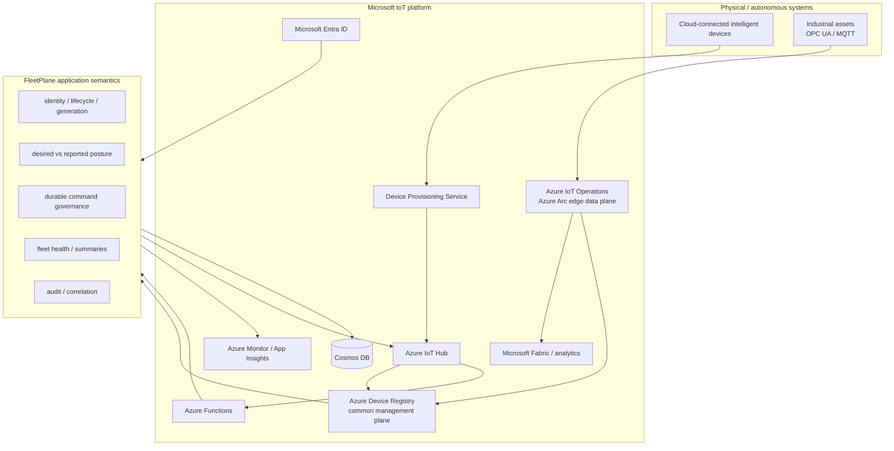

# FleetPlane

**Microsoft IoT–native supervisory control plane for autonomous, industrial, and AI-enabled edge fleets.**

> **Repository status:** public engineering reference implementation / GitHub showcase. It is designed to demonstrate distributed-systems and Microsoft IoT architecture rigor; it is **not** presented as a production-certified fleet platform or a safety-critical controller.

FleetPlane explores the application layer that appears when an intelligent edge prototype becomes a managed fleet of real machines. Microsoft provides the hyperscale IoT substrate—**Device Provisioning Service (DPS), Azure IoT Hub, Azure Device Registry, Azure IoT Operations, Azure Functions, Cosmos DB, Entra ID, Azure Monitor, and optionally Microsoft Fabric**. FleetPlane provides the domain semantics above that substrate: **device lifecycle, hardware generations, desired/reported state, fleet health, durable supervisory commands, local-autonomy policy, audit, and failure-aware reconciliation**.

The central engineering question is:

> **Can intelligent physical assets remain locally authoritative while a Microsoft IoT control layer safely provisions, represents, observes, configures, and supervises them under disconnection, duplicate delivery, stale state, retries, concurrency, and partial failure?**

**Current release: v0.6.0**  
**Verified local state: 47 tests passing · 82.90% branch-aware coverage · deterministic 100-device reference experiment · 9/9 acceptance assertions passing**

---

## Start here

### If you have 5 minutes

Run the deterministic reference experiment:

```bash
python -m venv .venv
source .venv/bin/activate        # Windows: .venv\Scripts\activate
python -m pip install -e '.[dev]'
fleetplane showcase --devices 100 --restricted-devices 5
```

You should see one JSON result proving the scenario detected/handled:

```text
duplicate telemetry                  ✓
sequence gap                         ✓
out-of-order telemetry                ✓
offline durable spooling              ✓
local policy rejection                ✓
configuration convergence             ✓
stale revision rejection              ✓
unsafe restart rejected locally       ✓
diagnostic command accepted           ✓
```

### If you have 20 minutes

1. Read this README through **Architecture in one diagram**.
2. Run the reference experiment.
3. Read [docs/VERIFICATION.md](docs/VERIFICATION.md).
4. Open [src/fleetplane/core/ingestion.py](src/fleetplane/core/ingestion.py), [src/fleetplane/services/outbox.py](src/fleetplane/services/outbox.py), and [src/fleetplane/microsoft_iot.py](src/fleetplane/microsoft_iot.py).

### If you want the engineering deep dive

Use [docs/REVIEWER_GUIDE.md](docs/REVIEWER_GUIDE.md) as a guided tour through architecture, methodology, cloud mapping, security boundaries, and evidence.

---

## What this repository demonstrates

| Claim | Evidence in the repository | What is **not** implied |
|---|---|---|
| duplicate/reordered telemetry does not corrupt current state | deterministic scenario + ingestion/concurrency tests | exactly-once delivery from a real cloud provider |
| cloud intent survives process failure before dispatch | transactional outbox + lease tests | zero message loss under every infrastructure failure |
| duplicate commands do not execute twice at the simulated edge | persistent command journal tests | safety certification of real machinery |
| desired state is distinct from device-applied state | configuration ACK/revision tests + IoT Hub adapter contracts | IoT Hub acceptance equals physical application |
| cloud workers can update state concurrently without projection rewind | optimistic-version concurrency tests | unlimited horizontal scale without live qualification |
| device identity starts at provisioning, not arbitrary telemetry | lifecycle/generation tests | complete production PKI implementation |
| Microsoft IoT concepts map cleanly to the FleetPlane domain model | DPS / Device Registry / IoT Operations contract tests | measured Azure service throughput or SLA |
| fleet/site/global summaries can be replay-safe projections | Cosmos summary projection tests | production change-feed latency guarantees |

The repository follows a simple evidence rule: **implemented behavior is separated from measured provider performance and from future design targets**. See [docs/METHODOLOGY.md](docs/METHODOLOGY.md).

---

## Why FleetPlane exists

A machine-learning or embedded prototype can work perfectly on one development bench and still fail as a product once it becomes a geographically distributed fleet.

The new problems are usually not “train a better model.” They are:

```text
Which physical device is this?
Which hardware generation is active?
Which software/model/configuration should it run?
What did it actually apply?
What happened while it was offline?
Can duplicate messages change state twice?
Can an old event rewind the current projection?
What happens if the cloud process dies after a database commit?
Who asked the machine to do something?
Can the machine refuse unsafe cloud intent?
How does an operator see fleet-wide convergence and health?
```

FleetPlane is a reference implementation of those control-plane concerns.

---

## Architecture in one diagram



FleetPlane models two Microsoft connectivity patterns:

1. **Direct cloud device:** `device → DPS → IoT Hub → Functions → FleetPlane`.
2. **Industrial edge site:** `OPC UA/MQTT assets → Azure IoT Operations → Device Registry → FleetPlane`.

The local reference runtime substitutes SQLite and simulated devices for managed services so the distributed-state semantics can be reproduced without cloud infrastructure.

For the detailed Microsoft mapping, see [docs/MICROSOFT_IOT_PLATFORM.md](docs/MICROSOFT_IOT_PLATFORM.md).

---

## Division of responsibility

FleetPlane is intentionally **not another IoT broker, data lake, robot motion controller, or OTA transport**.

| Microsoft / edge-platform responsibility | FleetPlane responsibility |
|---|---|
| device connectivity and cloud messaging | operational meaning of device state |
| DPS provisioning and IoT Hub identity | business fleet/site identity and generation semantics |
| Device Registry resource representation | operational lifecycle and posture projection |
| Azure IoT Operations MQTT/OPC UA/data flows | application governance across intelligent assets |
| Azure Functions execution | idempotent application state transitions |
| Cosmos DB transactions/storage | per-device aggregate and durable outbox semantics |
| Entra identity platform | application authorization model (production hardening) |
| Azure Monitor/App Insights | FleetPlane traces/SLOs (production hardening) |
| Fabric / analytics destination | high-volume historical analytics outside the control store |
| local controller / robot / PLC | real-time control, safety, and local autonomy |

The design principle is:

> **Microsoft manages the IoT infrastructure. FleetPlane understands the intelligent machine. The edge remains authoritative for real-time operation.**

---

## The cloud is not the autonomous controller

FleetPlane is supervisory software. It is not a PLC, motion planner, braking controller, SIL/ASIL component, or safety-certified real-time loop.

```text
MICROSOFT CLOUD / FLEETPLANE
identity • policy • desired posture • health • commands • audit
                         │
                         ▼
                  supervisory intent
                         │
                         ▼
EDGE DEVICE / INDUSTRIAL SITE
sensing • inference • local safety • persistence • real-time control
```

A command can be durably accepted by FleetPlane and still be rejected by the device. The reference experiment explicitly sends a restart request while a simulated device is active; the device rejects it by local policy.

---

## Core domain model

### Provisioned identity and lifecycle

Telemetry cannot invent a fleet identity. A device is explicitly provisioned and moves through:

```text
PROVISIONED
    ↓
ACTIVE
   ├────────→ QUARANTINED
   ├────────→ DISABLED
   └────────→ DECOMMISSIONED
```

FleetPlane separates:

```text
device_id           logical asset identity
device_generation   physical hardware generation under that identity
boot_id             one runtime boot session
sequence            event ordering within a boot/generation context
```

This prevents old or replacement hardware from silently inheriting a newer physical unit's operational state.

### Telemetry identity and ordering

A telemetry event is identified operationally by:

```text
(device_id, device_generation, boot_id, sequence)
```

The ingestion path distinguishes:

```text
normal event
duplicate
gap detected
out-of-order event
old boot/generation
invalid identity
```

Late data can be retained as evidence without rewinding the current device projection.

### Desired versus reported state

FleetPlane separates what the cloud wants from what the device has actually applied:

```text
FleetPlane desired revision 148
          ↓
transactional outbox
          ↓
IoT Hub twin desired properties
          ↓
device evaluates local policy
     ┌────┴────┐
     ▼         ▼
   apply     reject
     │         │
     └────┬────┘
          ▼
reported/config ACK
```

A successful twin update means the cloud service accepted desired state. It is deliberately **not** interpreted as proof that the physical device applied it.

### Durable commands

Interactive commands use an asynchronous path:

```text
POST command
    ↓
command + audit + outbox commit
    ↓
202 Accepted
    ↓
leased background dispatcher
    ↓
IoT Hub direct method / local gateway
    ↓
edge policy
    ↓
ACK / rejection / timeout
```

The simulated edge keeps a persistent `command_id → result` journal so redelivery does not execute a restart-class action twice.

### Transactional outbox

FleetPlane avoids the classic dual-write failure:

```text
BAD
save business state
→ process crashes
→ outbound device action is lost
```

Instead:

```text
ONE DATABASE TRANSACTION
business state
+ audit
+ outbox intent
        ↓
      COMMIT
        ↓
background dispatch / retry
```

Workers claim outbox records with leases so independent workers do not intentionally dispatch the same pending work simultaneously. Device/API idempotency remains a second line of defense.

---

## Microsoft IoT platform mapping in code

[src/fleetplane/microsoft_iot.py](src/fleetplane/microsoft_iot.py) contains executable mappings for:

- `MicrosoftIoTPlatform.topology()` — platform responsibility map;
- `registry_projection(state)` — deterministic Azure Device Registry attributes/tags;
- `dps_intent(state)` — direct-device provisioning intent;
- `iot_operations_intent(state)` — industrial-edge asset intent;
- `AzureDeviceRegistryGateway` — management-plane adapter with injectable SDK client.

The running API exposes:

```text
GET /v1/platform/microsoft
GET /v1/platform/microsoft/devices/{device_id}
```

For one FleetPlane device, the second endpoint shows its:

```text
FleetPlane DeviceState
        ├── Azure Device Registry projection
        ├── DPS provisioning intent
        └── Azure IoT Operations asset intent
```

These are provider-contract surfaces, not claims that a live Azure environment was exercised by the local test suite.

---

## Azure Device Registry and Azure IoT Operations

Azure Device Registry is treated as the Microsoft management-plane representation of devices/assets. FleetPlane projects application attributes such as:

```text
fleetplane.lifecycle
fleetplane.siteId
fleetplane.fleetId
fleetplane.deviceGeneration
fleetplane.health
fleetplane.desiredRevision
fleetplane.reportedRevision
fleetplane.configConverged
fleetplane.modelVersion
```

Azure IoT Operations is the intended industrial-edge data plane for Arc-connected sites using MQTT/OPC UA. FleetPlane does not fake a local “IoT Operations deployment”; a real site requires Arc/Kubernetes, storage, broker, network, and OT-specific design choices.

---

## Control plane versus analytical data plane

FleetPlane's Cosmos model is for operational state, not indefinite high-rate sensor history.

```text
OPERATIONAL CONTROL PLANE
current state • desired state • commands • audit • outbox • receipts
        ↓
Cosmos DB

ANALYTICAL DATA PLANE
high-volume historical telemetry / AI / business analytics
        ↓
Microsoft Fabric or customer-selected analytics destination
```

This keeps transactional control concerns separate from analytical retention and reporting workloads.

---

## Reference experiment

Run:

```bash
fleetplane showcase --devices 100 --restricted-devices 5
```

The deterministic scenario injects controlled failures rather than simply generating random telemetry.

| Intervention | Expected observation |
|---|---|
| duplicate telemetry | second receipt classified duplicate; current projection advances once |
| skipped sequence | gap classified |
| old event after newer event | out-of-order classification; current state does not rewind |
| 20 devices offline for 3 ticks | 60 telemetry events persist in local spools |
| revision 1 violates five local policies | 95 apply / 5 reject |
| remedial revision 2 | 100 devices converge |
| revision 1 replayed after revision 2 | 100 stale replays rejected |
| restart while device is active | local device policy rejects |
| diagnostic ping | accepted |

Write a machine-readable evidence envelope:

```bash
fleetplane showcase \
  --devices 100 \
  --restricted-devices 5 \
  --evidence evidence/reference-scenario.json
```

The committed v0.6.0 evidence is in [evidence/reference-scenario-v0.6.0.json](evidence/reference-scenario-v0.6.0.json).

---

## Verification model

Run the full local gate:

```bash
pytest --cov=fleetplane --cov-branch --cov-report=term-missing
```

The release evidence distinguishes three classes:

1. **Deterministic local evidence** — simulator, SQLite, concurrency, outbox, lifecycle, command journal.
2. **Provider-contract evidence** — Cosmos/IoT Hub/Device Registry interaction semantics with injected/fake clients.
3. **Live provider qualification** — real Azure service latency, RU consumption, scale-out, quotas, reconnect behavior, and cost. **Not claimed by v0.6.0.**

See:

- [docs/METHODOLOGY.md](docs/METHODOLOGY.md) — hypotheses, variables, acceptance criteria, threats to validity;
- [docs/VERIFICATION.md](docs/VERIFICATION.md) — exact claim/evidence boundaries;
- [evidence/verification-v0.6.0.md](evidence/verification-v0.6.0.md) — executed release record.

---

## What is verified and what is deliberately not claimed

### Verified locally / through provider contracts

- telemetry idempotency and ordering;
- concurrency-safe device projection updates;
- monotonic desired revisions;
- transactional outbox and worker leasing;
- command idempotency at API and simulated-device boundaries;
- lifecycle and hardware-generation enforcement;
- authenticated IoT Hub identity extraction contract;
- desired-property versus direct-method semantic separation;
- same-partition Cosmos transaction construction;
- replay-safe Cosmos summary projections;
- Device Registry resource projection/payload construction;
- DPS and Azure IoT Operations intent mapping.

### Not claimed

- measured real-IoT-Hub throughput;
- measured Cosmos RU consumption or latency;
- Azure Functions scale-out benchmarks;
- Azure IoT Operations performance;
- production certificate issuance/rotation;
- production Entra RBAC;
- multi-region disaster recovery;
- safety certification;
- production SLA/SLO attainment.

A local 100-device experiment proves application behavior under controlled conditions. It does **not** prove Azure hyperscale performance.

---

## Infrastructure as code

[infra/terraform/](infra/terraform/) models the Microsoft production substrate:

```text
Azure Resource Group
├── Azure IoT Hub
├── Device Provisioning Service
├── Azure Device Registry namespace
├── Azure Functions
├── Cosmos DB
│   ├── control /device_id
│   ├── summaries /scope_id
│   └── change-feed leases
└── Static Web Apps
```

Azure IoT Operations is intentionally excluded from the generic baseline Terraform because an Arc-connected industrial site has topology and storage/network decisions that should be made per deployment.

The repository has **no automatic `terraform apply` workflow**. The manually triggered Azure workflow performs an OIDC-authenticated Terraform plan.

---

## CI and software-engineering gates

GitHub Actions contains separate workflows for:

```text
CI
  Ruff
  strict mypy
  pytest + branch coverage
  reference scenario
  wheel build
  evidence artifacts

CodeQL
Terraform fmt / validate
Azure OIDC Terraform plan (manual)
Dependabot
```

The branch-coverage floor is **80%**, but the project treats adversarial invariant tests as more important than maximizing the percentage itself.

---

## Repository map

```text
fleetplane/
├── src/fleetplane/
│   ├── domain/                 # models and enums
│   ├── core/                   # ingestion, lifecycle, config, commands, reconciliation
│   ├── ports/                  # provider-neutral contracts
│   ├── adapters/               # SQLite, Cosmos, IoT Hub, summary projection
│   ├── services/outbox.py      # durable dispatch / leasing
│   ├── simulator/              # deterministic edge fleet
│   ├── api/                    # FastAPI control surface
│   ├── azure_ingress.py        # authenticated IoT Hub/Event Hub ingress boundary
│   ├── microsoft_iot.py        # Microsoft platform mapping
│   └── runtime.py              # composition root
├── azure/functions/            # Azure Functions entry points
├── infra/terraform/            # Microsoft cloud IaC model
├── tests/                      # invariant + provider-contract tests
├── evidence/                   # release evidence
├── docs/                       # deep technical documentation
└── web/                        # deliberately small fleet dashboard
```

---

## Where FleetPlane is useful

The common target is **software-defined physical equipment whose operational state matters enough to require identity, lifecycle, policy, audit, and failure-aware supervision**.

Examples include:

- industrial edge-AI appliances;
- predictive-maintenance gateways;
- autonomous inspection systems;
- machine-vision edge fleets;
- distributed energy/condition-monitoring systems;
- OEM installed-base operations;
- supervisory layers around warehouse/mobile robots;
- EAM/ERP enrichment where machine operational state must become business-grade asset information.

FleetPlane is usually the wrong abstraction for simple commodity sensors, hard real-time process control, PLC replacement, raw telemetry warehousing, or robot path/traffic planning.

See [docs/USE_CASES.md](docs/USE_CASES.md).

---

## Documentation map

| Document | Purpose |
|---|---|
| [Reviewer guide](docs/REVIEWER_GUIDE.md) | fastest route through the repository |
| [Microsoft IoT platform](docs/MICROSOFT_IOT_PLATFORM.md) | DPS / IoT Hub / Device Registry / IoT Operations mapping |
| [Architecture](docs/ARCHITECTURE.md) | detailed domain, transactions, concurrency, summaries |
| [Methodology](docs/METHODOLOGY.md) | scientific/experimental method and validity limits |
| [Verification](docs/VERIFICATION.md) | test and evidence boundaries |
| [Security](docs/SECURITY.md) | trust boundaries and production hardening gaps |
| [Architecture decisions](docs/DECISIONS.md) | why the design looks this way |
| [Use cases](docs/USE_CASES.md) | realistic system fit / non-fit examples |
| [Engineering review](docs/ENGINEERING_REVIEW.md) | portfolio strengths and production gaps |
| [Azure runtime](docs/AZURE.md) | Functions, Cosmos, IoT Hub, Terraform details |
| [Roadmap](docs/ROADMAP.md) | intentionally limited next steps |
| [Glossary](docs/GLOSSARY.md) | terminology |

---

## Project boundary and future work

FleetPlane v0.6.0 is intentionally a **reference implementation stopping point**, not an attempt to publish a full commercial SaaS product.

The highest-value production-oriented extensions are documented rather than silently implied:

1. Entra-backed operator authentication/authorization;
2. OpenTelemetry/Application Insights end-to-end traces and explicit SLO evidence;
3. live DPS/IoT Hub/Cosmos/Device Registry qualification;
4. versioned command contracts;
5. production deployment promotion, private networking, immutable audit/export, and stronger supply-chain controls.

Those are productization concerns. The current public repository focuses on making the underlying distributed-system and Microsoft-IoT reasoning easy to inspect, reproduce, and critique.

---

## Contributing and security

Contributions should strengthen a documented invariant or close a clearly stated limitation. See [CONTRIBUTING.md](CONTRIBUTING.md).

For security-reporting guidance, see [SECURITY.md](SECURITY.md).
