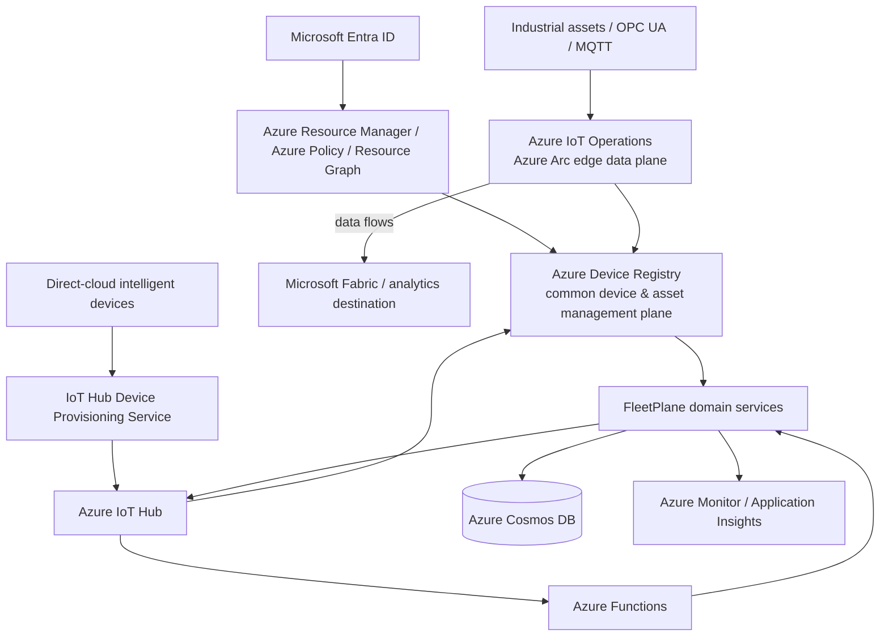

# Microsoft IoT Platform Architecture

FleetPlane is intentionally built around the Microsoft IoT platform rather than treating Azure as one interchangeable deployment target.

The application-level responsibility remains FleetPlane's: operational lifecycle, desired/reported posture, command governance, local-autonomy boundaries, idempotency, audit, and fleet projections. Microsoft services provide the managed connectivity, resource-governance, provisioning, event execution, control-state infrastructure, operator identity, and analytics substrate.

## Platform map



The diagram expresses two supported architectural patterns, not two different FleetPlane products.

## Pattern A — cloud-connected intelligent devices

Use this path for Linux/Jetson/industrial-PC/embedded devices that connect directly to Azure.

```text
device manufacturing identity
        ↓
IoT Hub Device Provisioning Service (DPS)
        ↓
assigned IoT Hub
        ↓
IoT Hub device-to-cloud telemetry
        ↓
Azure Functions
        ↓
FleetPlane ingestion + control aggregate
        ↓
Cosmos DB
```

The reverse supervisory path is:

```text
FleetPlane desired posture
        ↓
transactional outbox
        ↓
IoT Hub twin desired properties
        ↓
device local policy
        ↓
reported/apply acknowledgement
```

Interactive operations map to IoT Hub direct methods. Persistent desired state maps to twin desired properties.

DPS is the provisioning substrate. FleetPlane's `MicrosoftIoTPlatform.dps_intent()` exposes the device-level provisioning intent without embedding enrollment secrets in the domain model.

## Pattern B — industrial edge-connected assets

Use this path when assets sit behind an industrial edge site rather than connecting individually to the cloud.

```text
PLC / machine / sensor / camera
        ↓
OPC UA or MQTT
        ↓
Azure IoT Operations on Azure Arc
        ├── MQTT broker
        ├── connector for OPC UA
        ├── data flows
        └── device/asset discovery
        ↓
Azure Device Registry
        ↓
FleetPlane operational governance
```

Azure IoT Operations is treated as the Microsoft-managed edge data plane. FleetPlane does **not** replace its MQTT broker, OPC UA connector, data-flow engine, or Arc lifecycle.

FleetPlane adds higher-level semantics that are intentionally application-specific:

- business fleet/site membership;
- operational lifecycle (`PROVISIONED`, `ACTIVE`, `QUARANTINED`, `DISABLED`, `DECOMMISSIONED`);
- physical device generation versus reboot identity;
- desired software/model/configuration posture;
- local-autonomy command policy;
- configuration convergence;
- operational audit and request correlation;
- control-plane health projections.

## Azure Device Registry is the common management plane

Azure Device Registry is the common Microsoft management-plane abstraction across Azure IoT Operations and Azure IoT Hub.

FleetPlane projects its device state into Device Registry attributes/tags through `MicrosoftIoTPlatform.registry_projection()`. The deterministic mapping is contract-tested without making an Azure request.

The concrete `AzureDeviceRegistryGateway` maps that projection to the Device Registry management API.

Important service maturity boundary:

- Device Registry with Azure IoT Operations is a generally available Microsoft service path.
- Device Registry integration with Azure IoT Hub is currently a Microsoft preview capability and is therefore treated as opt-in/qualification work rather than an invisible production dependency.

FleetPlane's operational control state remains independently represented in Cosmos DB, so the application does not depend on a preview management-plane feature for its correctness model.

## Why FleetPlane still has Cosmos DB

Azure Device Registry is a management plane. FleetPlane also needs application transaction boundaries such as:

```text
desired configuration
+ device projection
+ audit record
+ outbound intent
```

and:

```text
command
+ audit record
+ outbox work item
+ idempotency key
```

Those transitions are modeled as a per-device Cosmos aggregate partitioned by `/device_id`, allowing same-device transactional batches.

Device Registry and Cosmos therefore serve different responsibilities:

| Responsibility | Microsoft service / FleetPlane component |
|---|---|
| Azure resource representation, RBAC/policy/tags | Azure Device Registry / ARM |
| zero-touch assignment to IoT Hub | DPS |
| device cloud messaging | IoT Hub |
| industrial edge connectivity | Azure IoT Operations |
| FleetPlane application transactions | Cosmos DB |
| event-driven workers/API host | Azure Functions |
| operator identity target | Microsoft Entra ID |
| operational telemetry/tracing target | Azure Monitor / Application Insights |
| large-scale analytical history | Microsoft Fabric or another analytics destination |

## FleetPlane versus Microsoft services

FleetPlane is deliberately **not** a reimplementation of the Microsoft IoT platform.

Microsoft owns the horizontal infrastructure primitives. FleetPlane models the vertical operational semantics of intelligent machines.

```text
Microsoft IoT platform asks:
How is this device connected, represented, provisioned, governed and routed?

FleetPlane asks:
What should this intelligent machine be doing, what is it actually doing,
what lifecycle/policy applies, and what supervisory action is safe and auditable?
```

## Code evidence

The Microsoft platform mapping is implemented in:

```text
src/fleetplane/microsoft_iot.py
```

It provides:

- `MicrosoftIoTPlatform.topology()`;
- `registry_projection(DeviceState)`;
- `dps_intent(DeviceState)`;
- `iot_operations_intent(DeviceState)`;
- `AzureDeviceRegistryGateway`.

The API exposes the mapping for inspection:

```text
GET /v1/platform/microsoft
GET /v1/platform/microsoft/devices/{device_id}
```

The Azure IoT Hub transport remains in:

```text
src/fleetplane/adapters/azure_iothub.py
```

and authenticated IoT Hub ingress binding remains in:

```text
src/fleetplane/azure_ingress.py
azure/functions/function_app.py
```

## Infrastructure as code

`infra/terraform/` models the Microsoft cloud substrate:

- Azure IoT Hub;
- Device Provisioning Service;
- Azure Device Registry namespace through AzAPI;
- Azure Functions;
- Cosmos DB control, summary, and lease containers;
- Function managed identity and data-plane role assignments;
- Static Web Apps for the intentionally compact operator UI.

Azure IoT Operations is not provisioned by this Terraform baseline because it requires an Azure Arc-enabled Kubernetes edge environment and deployment decisions that are site-specific. It is represented as the industrial-edge integration pattern rather than hidden behind a fake local cluster.

## Microsoft source references

The architecture is aligned to Microsoft's current service boundaries:

- Azure IoT overview: <https://learn.microsoft.com/azure/iot/>
- Azure Device Registry: <https://learn.microsoft.com/azure/iot/iot-device-registry-overview>
- Azure IoT Hub: <https://learn.microsoft.com/azure/iot-hub/iot-concepts-and-iot-hub>
- Device Provisioning Service: <https://learn.microsoft.com/azure/iot-dps/about-iot-dps>
- Azure IoT Operations: <https://learn.microsoft.com/azure/iot-operations/overview-iot-operations>
- Azure IoT Operations data flows: <https://learn.microsoft.com/azure/iot-operations/connect-to-cloud/overview-dataflow>
